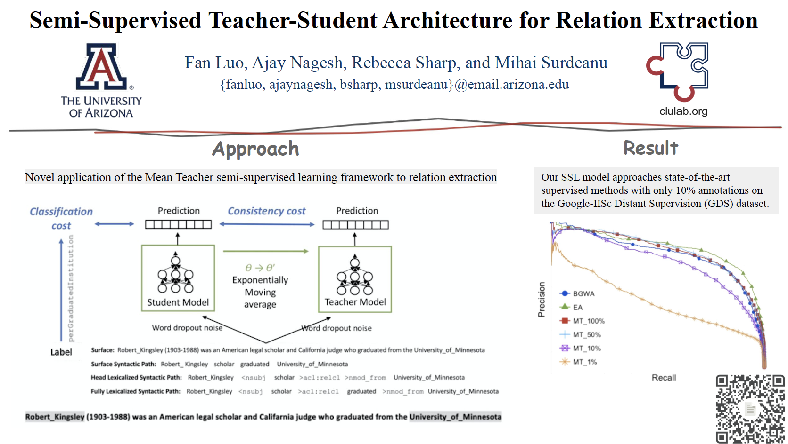
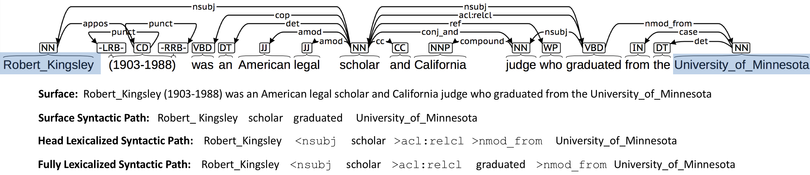

# Semi-Supervised Teacher-Student Architecture for Relation Extraction

By Fan Luo, Ajay Nagesh, Rebecca Sharp, and Mihai Surdeanu ([Clulab](http://clulab.cs.arizona.edu/))

 

In this work, we adapt [Mean Teacher](https://arxiv.org/abs/1703.01780) (Tarvainen and Valpola, 2017), a denoising SSL framework to extract semantic relations between pairs of entities. We explore the sweet spot of amount of supervision required for good performance on this binary relation extraction task.

Within the Mean Teacher framework, we investigate input representations of four types of syntactic abstraction. For example (Robert Kingsley, perGraduatedInstitution, Uni- versity of Minnesota):

We evaluate our approach on the Google-IISc Distant Supervision (GDS) dataset.(Jat et al., 2017). Our results show that the SSL Mean Teacher approach nears the performance of fully-supervised approaches even with only 10% of the labeled corpus. Further, the syntax-aware model out- performs other syntax-free approaches across all levels of supervision.

 
## Usage

#### TRAIN:    
python main.py --dataset=gids --labels=100.0 --arch=lstm\_RE --train-subdir=train\_fullyLex --eval-subdir=dev\_fullyLex --epochs=200 --labeled-batch-size=64 --random-seed=366 --consistency=1 --consistency-rampup=5 --word-frequency=5 --print-freq=2 --pretrained-wordemb=True --wordemb-size=100 --random-initial-unkown=True --update-pretrained-wordemb=True --run-name log\_gids\_labels100.0\_epochs200\_labeled64\_cons1\_ramp5\_pre\_update\_rand366\_wf5\_fullyLex > logs/log\_gids\_labels100.0\_epochs200\_labeled64\_cons1\_ramp5\_pre\_update\_rand366\_wf5\_fully
Lex.txt 2>&1

#### TEST:
python eval\_saved\_model.py --dataset=gids --labels=100.0 --arch=lstm\_RE --train-subdir=train\_fullyLex --eval-subdir=test\_fullyLex --labeled-batch-size=64 --random-seed=366 --word-frequency=5 --print-freq=2 --pretrained-wordemb=True --wordemb-size=100 --random-initial-unkown=True --update-pretrained-wordemb=True --run-name gids\_labels100.0\_labeled64\_pre\_update\_wf5\_fullyLex\_test --ckpt-file='best.ckpt' --ckpt-path='main\_log\_gids\_labels100.0\_labeled64\_pre\_update\_wf5\_fullyLex\_test/2019-04-03_19:39:45/0/transient' > test\_results/gids\_labels100.0\_labeled64\_pre\_update\_wf5\_fullyLex\_test.txt 

